# SuperFoodie 超级吃货智能助手 CS599 大作业报告

| 字段 | 内容 |
|---|---|
| 课程名称 | CS599 企业级应用软件设计与开发 |
| 项目名称 | SuperFoodie 超级吃货智能助手 |
| 项目方向 | 方向一：Agentic AI 原生开发 |
| 学号 | （待填写学号） |
| 姓名 | （待填写姓名） |
| 专业 | 计算机技术 |
| 提交日期 | 2026 年 6 月 22 日 |
| 部署 URL | Render Web Service，待部署后替换：`https://<your-service>.onrender.com` |

> 安全说明：报告、截图和图表只展示环境变量机制与脱敏日志，不包含 `.env`、Cookie、API Key、id_token 或 device id。线上 Demo 计划禁用小红书 Cookie：`AIONE_ENABLED=0`。

---

## 一、选题背景与设计思想（20 分）

### 1.1 问题定义

SuperFoodie 面向“今天吃什么”这个高频但复杂的生活决策场景。用户可能是在家做饭，也可能是出门到某个商圈吃饭。真实决策不仅需要菜名或店名，还需要考虑人数、预算、口味、近期身体状态、近期吃过什么、商圈位置、餐后活动、图片可信度以及最终沉淀为个人偏好记忆。

### 1.2 现有方案不足

- 菜谱网站能给做法，但很少结合用户近期足迹、健康禁忌和多轮选择。
- 地图平台能返回真实 POI、评分和地址，但缺少小红书式的图片、推荐菜和“为什么值得去”。
- 小红书图文真实感强，但店名、楼层、评分等结构化字段不稳定；抓评论还会触发账号风控，因此项目明确不抓评论获取店名。
- 普通大模型聊天可以给建议，但缺乏工具调用、状态机、错误兜底、调试日志、PDF 归档和可复现验收链路。

### 1.3 项目价值

本项目把美食决策拆成 Agent 可执行流程：先理解用户意图，再调用高德、小红书、Tavily、Graph-RAG、Milvus、PDF 导出等工具，最后产出可查看、可确认、可导出、可沉淀的结果。项目不是单纯生成文本，而是把“搜索、筛选、融合、验证、记忆写入”串成一个工程闭环。

### 1.4 技术路线

- 后端：FastAPI + LangGraph 风格状态机，LangGraph 不可用时降级到 SimpleGraph。
- Agent：DeepSeek V4 快速规划候选，工具层补全真实图文和结构化信息。
- 数据源：高德负责真实 POI，小红书负责本地图文种草，Tavily 作为部署模式图片容错。
- 记忆：Graph-RAG 维护健康规则，Milvus 维护近期足迹和向量相似去重。
- 交付：前端多轮卡片交互，ReportLab 导出 PDF，MCP 提供轻量协议演示。

---

## 二、Specs 规格文档（20 分）

### 2.1 Product Spec

Product Spec 对应 `docs/product_spec.md`，定义两条核心主链路：

- 自己做：输入人数、健康状态和想吃方向，返回 3 个候选菜；用户加入备选菜单后，PDF 只包含菜品图片、食材、调料和步骤。
- 出去吃：先选商圈，再返回餐厅卡片；选定餐厅后，PDF 包含餐厅、推荐菜、具体地址和饭后娱乐建议，不再包含路线规划。

### 2.2 Architecture Spec

Architecture Spec 对应 `docs/architecture_spec.md`，系统拆分为 Web UI、FastAPI API、Agent Core、Tools Adapter、Graph-RAG、Milvus、外部 API 和 ReportLab 导出层。每一层都只暴露必要能力，避免把小红书、高德、Tavily 等平台逻辑直接散落在 UI 中。

### 2.3 API Spec

API Spec 对应 `docs/api_spec.md`。核心接口如下：

```text
POST /api/foodie/start
POST /api/foodie/{session_id}/interact
GET  /api/foodie/{session_id}/report
POST /api/foodie/map/business-areas
GET  /api/foodie/system/status
```

商圈接口支持 `debug=true` 返回高德原始 JSON 和过滤原因，普通用户路径默认只返回瘦身后的候选列表，减少响应体积和等待时间。

---

## 三、系统架构与设计（15 分）

本章按作业要求以图为主，文字只解释关键边界。

### 3.1 系统总体架构

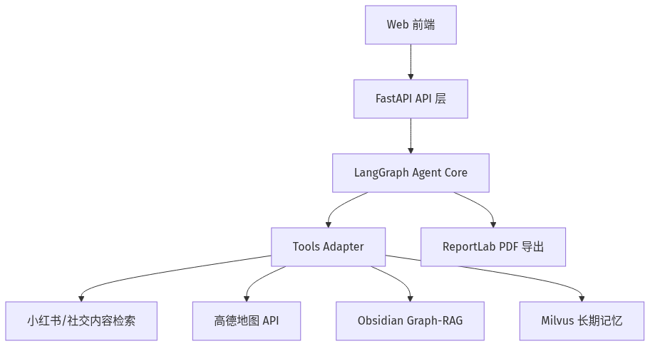


系统采用“前端交互 + 后端 Agent + 工具适配层 + 记忆层”的分层结构。Web UI 负责多轮交互和卡片确认，FastAPI 暴露稳定 API，Agent Core 管理状态与路由，Tools Adapter 封装外部服务，Graph-RAG/Milvus 负责规则和长期记忆。

### 3.2 LangGraph 状态机

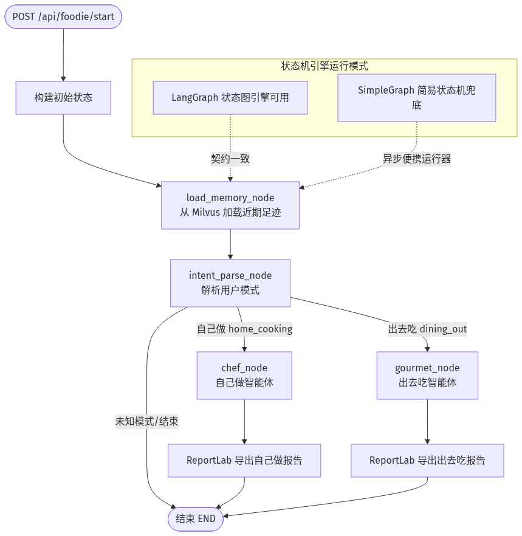


核心状态机为 `load_memory_node -> intent_parse_node -> chef_node/gourmet_node -> END`。当用户选择“自己做”时进入 `chef_node`，当选择“出去吃”时进入 `gourmet_node`。LangGraph 不可用时使用 SimpleGraph 保持同样的节点语义，保证 demo 可运行。

### 3.3 Agent State Schema

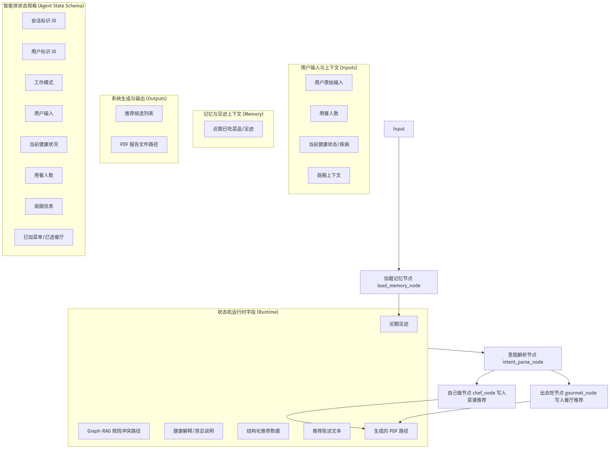


Agent state 维护 `session_id`、`user_id`、`mode`、`user_input`、`current_disease`、`dining_people_count`、`business_area_context`、`selected_items`、`recent_eaten`、`recommendations`、`report_path` 等字段。节点只读写自己的字段，减少多轮交互中状态混乱。

### 3.4 Agent 交互流程

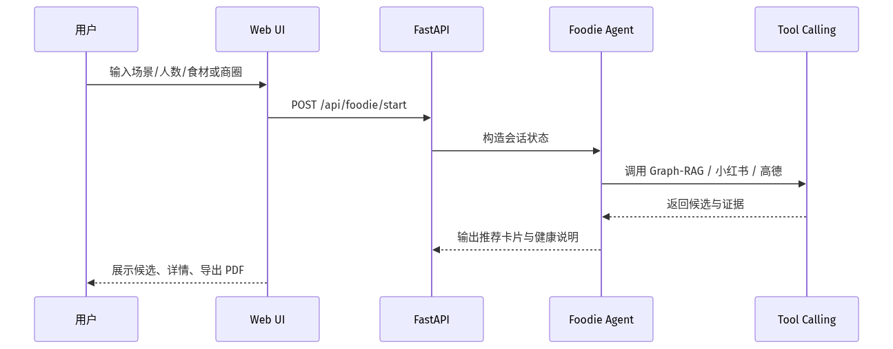


系统把用户的一次请求拆为多次工具调用，并在前端展示 Tool Calling Timeline。用户点击卡片、加入备选菜单、导出 PDF 才会形成强信号，避免把普通浏览误写入记忆。

### 3.5 数据流设计

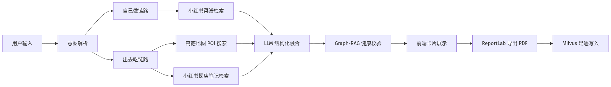


自己做链路以“DeepSeek 规划候选 + 小红书/Tavily 补图文 + PDF 沉淀”为核心；出去吃链路以“高德真实 POI + 小红书种草补充 + 餐后娱乐检索”为核心。

### 3.6 Graph-RAG 与 Milvus 记忆结构

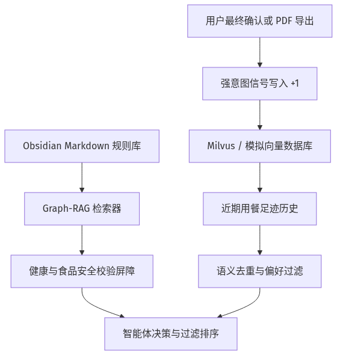


Graph-RAG 更适合维护可解释规则，例如食物禁忌、健康提醒和知识卡。Milvus 更适合维护用户足迹、近期吃过和相似去重。当前版本只在 PDF 导出或最终选择后写入，作为强意图信号。

---

## 四、关键实现与代码展示（15 分）

### 4.1 自己做链路

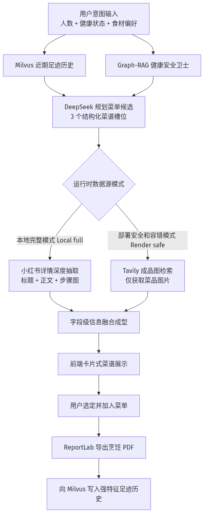


自己做链路分两步。第一步始终由 DeepSeek 根据用户提示、人数、健康状态、近期足迹和已选菜单生成 3 个候选菜。第二步按数据源补全图文：本地完整模式优先小红书详情抽取；部署容错模式使用 Tavily 补成品图；仍不合格时使用本地精选模板兜底。

关键代码位置：

- Agent 编排：`src/agent/graph.py`
- 菜谱推荐与数据源融合：`src/agent/chatbot.py`
- 图片代理与外部接口：`src/api/routes.py`

### 4.2 出去吃链路

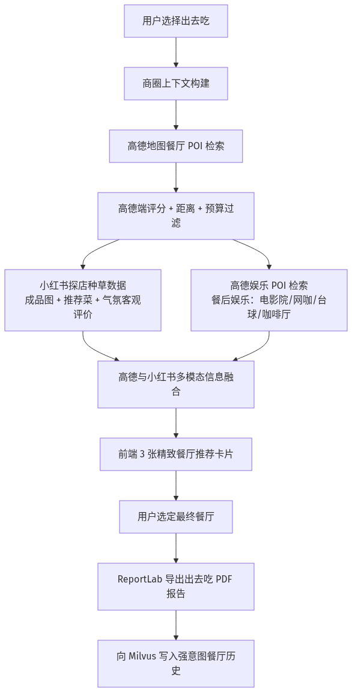


出去吃与自己做不是同一逻辑。用户选择商圈后，系统先从高德获取 4.0 分以上的真实餐厅，再用小红书补充图片、推荐菜和种草描述。饭后娱乐全部走高德 POI，不依赖小红书。

### 4.3 商圈检索与过滤

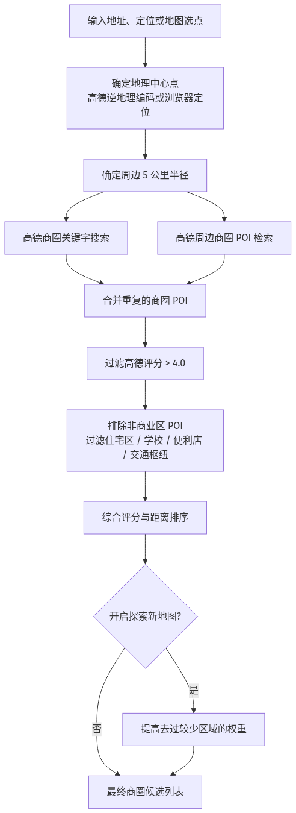


商圈选择支持用户输入、地图选点、浏览器定位三种入口。高德返回后做去重、评分过滤、非商圈排除、距离与评分综合排序。“探索新地图”会提高用户较少去过区域的权重。

### 4.4 小红书本地完整模式

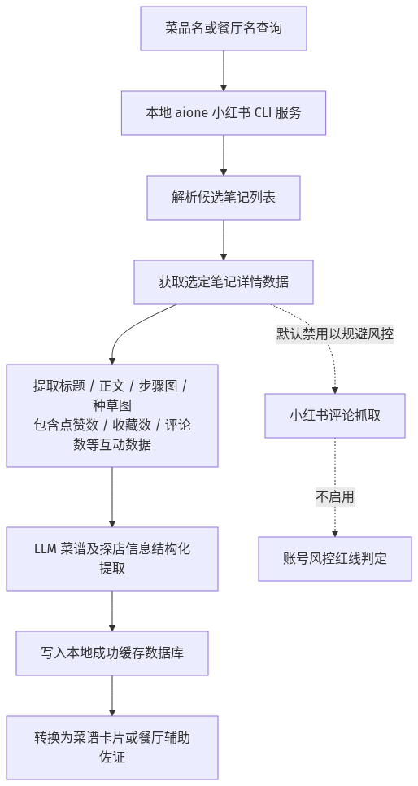


小红书接入通过本地 aione CLI 完成，流程为搜索笔记、获取详情、抽取标题正文图片和互动数据，再由 LLM 结构化为菜谱或探店摘要。安全策略是：不抓评论获取店名，避免账号风控；Cookie 只留在本地 `.env`，不进入部署环境。

### 4.5 Tavily 图片容错模式

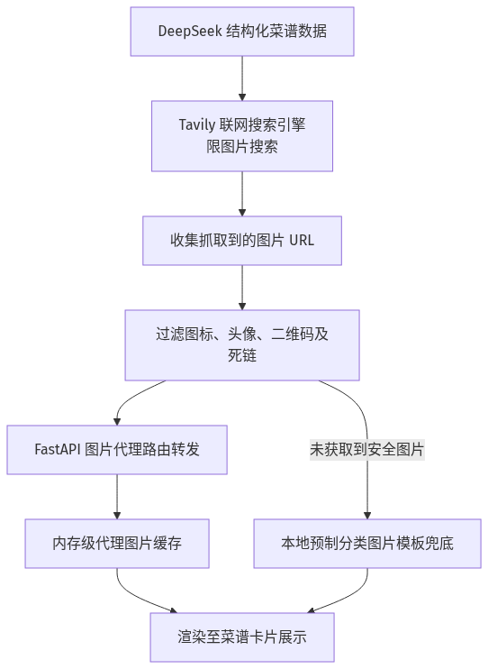


部署模式下，Tavily 不再负责结构化菜谱，只负责给 DeepSeek 已生成的候选菜补成品图。后端对图片 URL 做过滤和 image-proxy 代理，前端只拿代理后的图片地址，避免跨域、热链和空图问题。

### 4.6 高德 + 小红书餐厅融合


合并策略以高德结构化字段为准：店名、地址、评分、人均、距离、POI 类型来自高德；小红书只补充图片、推荐菜、主观描述和热度气氛。若小红书结果无法确认店名，则不展示为餐厅候选。

### 4.7 PDF 导出

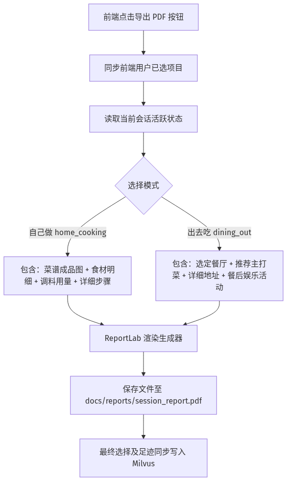


PDF 导出前同步前端已选卡片。自己做 PDF 只展示菜品、图片、食材、调料、步骤；出去吃 PDF 展示餐厅、推荐菜、地址和饭后娱乐。导出成功后，才向 Milvus 写入足迹。

### 4.8 MCP 协议演示

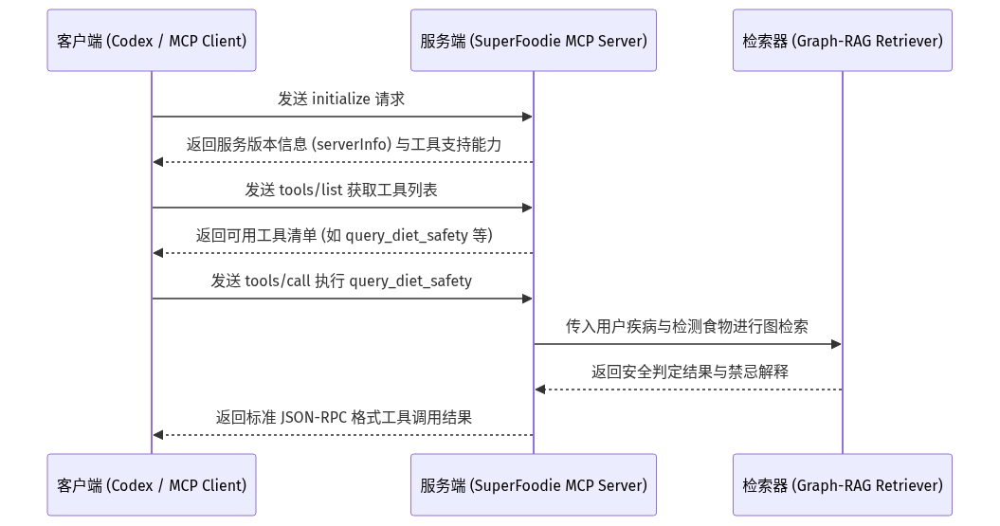


MCP Server 提供轻量工具 `query_diet_safety`，演示 `initialize`、`tools/list`、`tools/call` 三段式调用，满足“融合 MCP 协议 / Agentic RAG”加分项。

### 4.9 可观测性、错误处理与安全防护

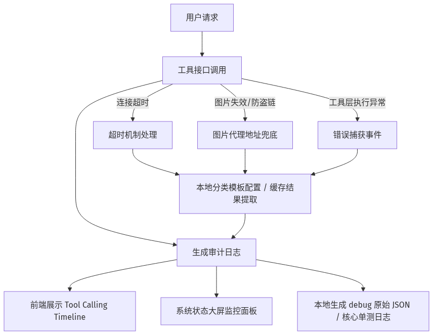


生产级能力体现在四点：外部 API 超时后有本地兜底，图片代理失败后回退默认图，工具调用过程有 Timeline 和审计日志，调试字段默认隐藏且仅 `debug=true` 返回。安全上不把 `.env`、Cookie、API Key 写入报告和部署配置。

---

## 五、测试与评估（10 分）

### 5.1 功能 Demo 截图

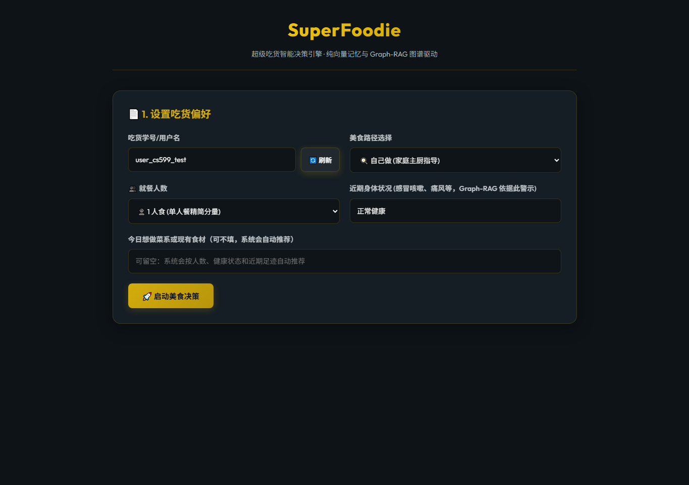


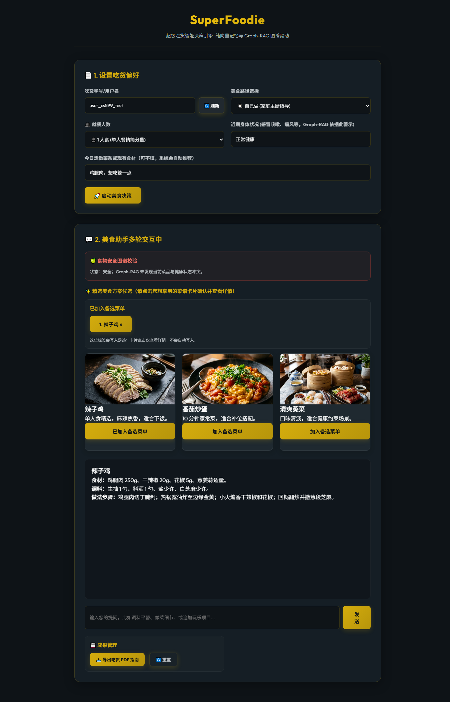


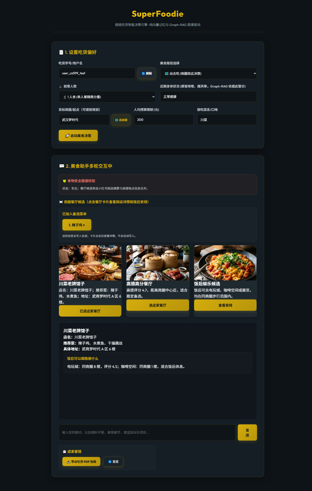


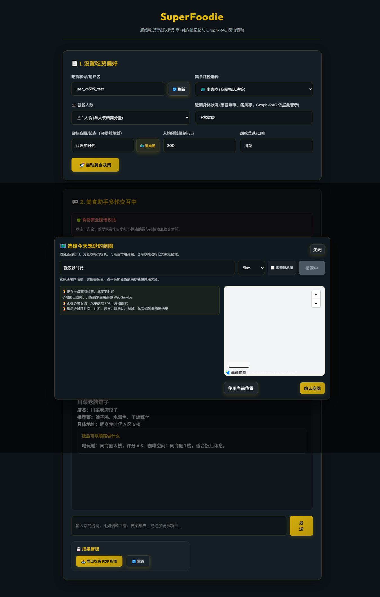


### 5.2 小红书本地完整模式截图

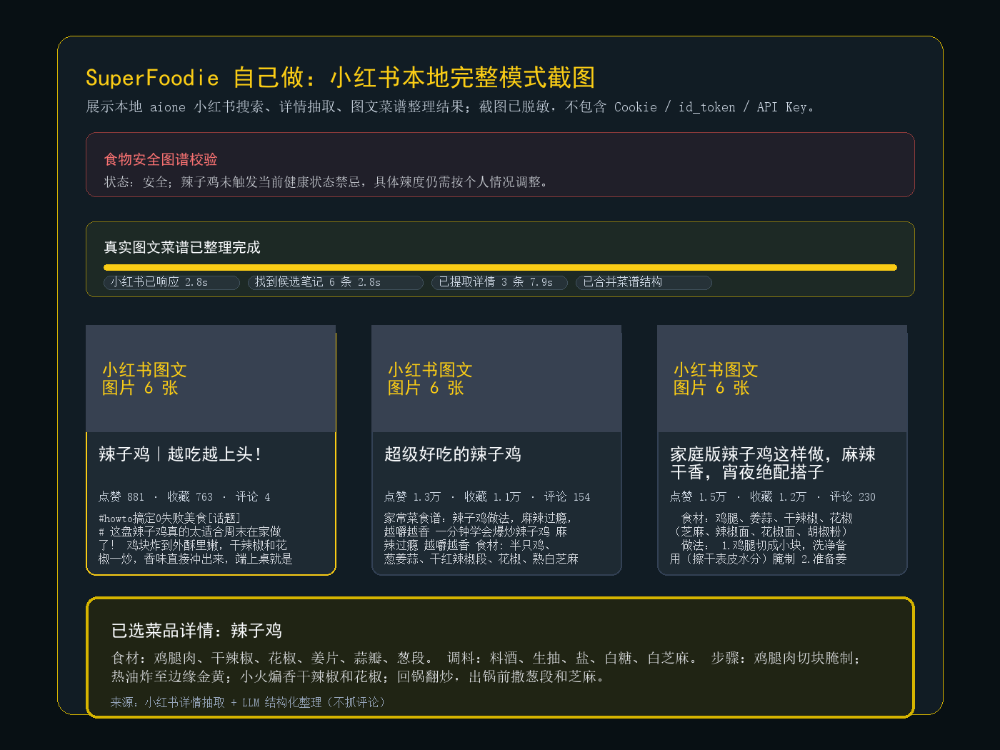


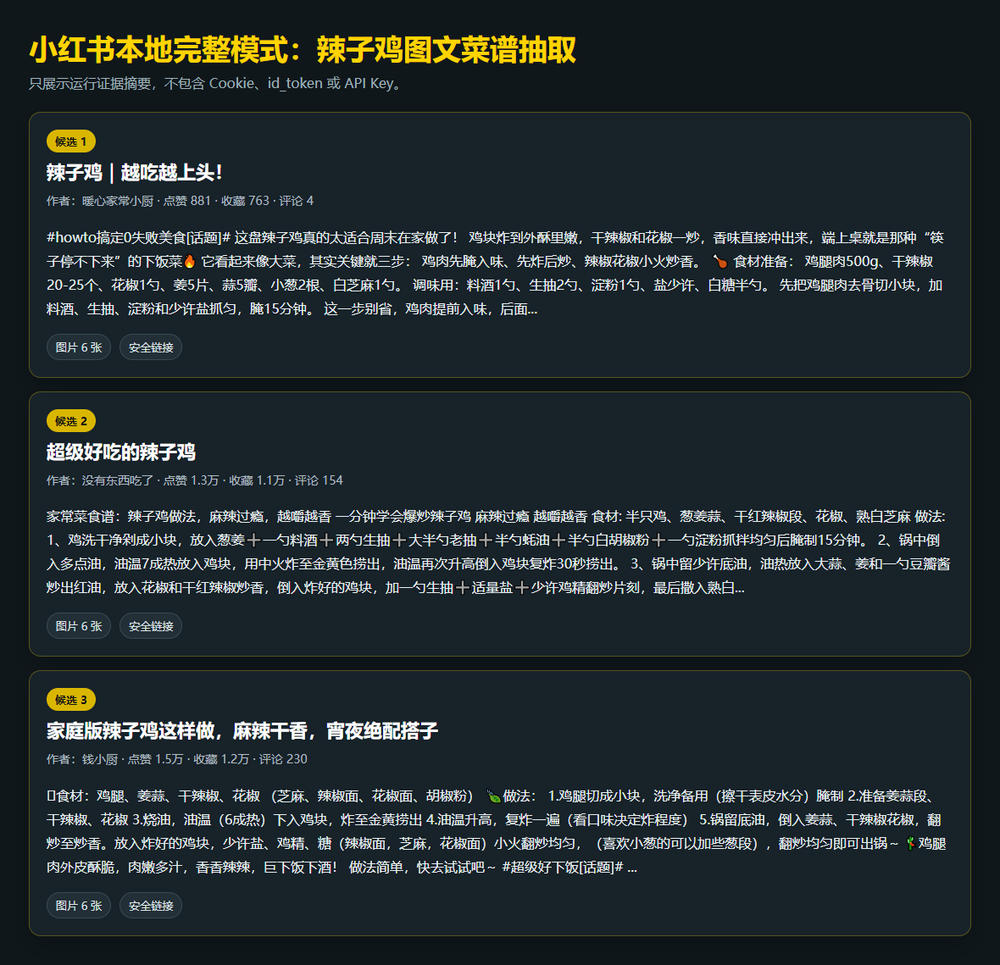


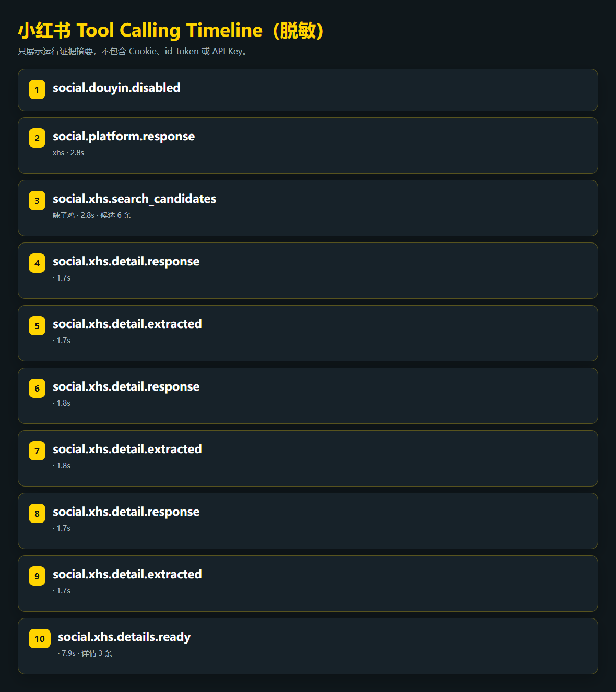


### 5.3 Tavily 图片容错截图


### 5.4 MCP Smoke Test

```json
{"jsonrpc": "2.0", "id": 1, "result": {"protocolVersion": "2024-11-05", "capabilities": {"tools": {}}, "serverInfo": {"name": "superfoodie-mcp-server", "version": "1.0.0"}}}
{"jsonrpc": "2.0", "id": 2, "result": {"tools": [{"name": "query_diet_safety", "description": "Evaluate food safety based on a user's disease and target food using GraphRAG.", "inputSchema": {"type": "object", "properties": {"disease": {"type": "string", "description": "The current health condition or disease of the user (e.g., gout, cold)."}, "food": {"type": "string", "description": "The food item to check for safety (e.g., beef, beer, seafood)."}}, "required": ["disease", "food"]}}, {"name": "search_recipes_online", "description": "Search for recipe details online, including ingredients, steps, and heat control info.", "inputSchema": {"type": "object", "properties": {"query": {"type": "string", "description": "The recipe or ingredient query (e.g., tomato egg)."}}, "required": ["query"]}}, {"name": "get_route_duration", "description": "Get transit routing duration estimation between origin and destination using Gaode Map.", "inputSchema": {"type": "object", "properties": {"origin": {"type": "string", "description": "Starting address or business district name."}, "destination": {"type": "string", "description": "Ending restaurant name."}}, "required": ["origin", "destination"]}}]}}
{"jsonrpc": "2.0", "id": 3, "result": {"content": [{"type": "text", "text": "{\"safety\": true, \"reason\": \"��ͼ�׼�¼���� 'seafood' �� 'gout' �в�����Ӧ��\", \"conflict_node\": null, \"path\": []}"}]}}

```

### 5.5 测试摘要

```text
CS599 SuperFoodie 测试与性能摘要

环境：
- Windows / Python venv
- 核心命令：.\venv\Scripts\python.exe -m pytest tests/test_map_business_area_api.py tests/test_mcp_server.py tests/test_report_generator.py tests/test_restaurant_agent.py -q
- 全量命令：.\venv\Scripts\python.exe -m pytest -q

结果：
- 核心测试：5 passed, 3 warnings，用时约 51.64s
- 全量测试：21 passed, 1 skipped, 78 warnings，用时约 193.38s

覆盖点：
- 商圈接口默认瘦身响应：普通请求不返回 raw_results / excluded_results。
- 商圈接口缓存：同一 query/city/radius/lnglat/explore_new 第二次请求不再调用高德。
- MCP Server：initialize / tools/list / tools/call 均可返回 JSON-RPC 结果。
- PDF 生成器：自己做与出去吃两种报告结构均可生成文件。
- 餐厅 Agent：验证动态候选结构，不再依赖固定店名。
- 多人餐自动规划：未指定菜名时稳定返回荤菜、素菜、汤槽位。

真实接口性能记录：
- 优化前：/api/foodie/map/business-areas 无输入 + 5km 周边请求约 19.5s，响应约 267KB。
- 优化后冷请求：约 5.4s，响应约 8.4KB，debug calls 4。
- 优化后缓存命中：约 26ms，响应约 8.4KB。
- debug=true：缓存命中时仍可返回 raw_results / excluded_results，响应约 34KB。

限制：
- 警告主要来自 PyMilvus ORM API deprecation、Starlette TestClient deprecation 和 datetime.utcnow deprecation，不影响当前 Demo。
- 小红书评论抓取默认关闭，避免账号风控。

2026-06-21 自己做链路性能优化补充：
- 明确菜名不再先扩展成 3 个检索词；模糊口味/宽泛食材才扩展。
- 小红书详情抽取改为有限并发，并默认只让 1 条候选进入 LLM 菜谱结构化。
- 增加小红书搜索详情缓存与菜谱抽取成功缓存。
- 弱菜谱正文直接跳过 LLM，避免普通种草短文拖慢链路。
- 小红书/Tavily 联网候选不足 3 条时，Agent 层使用本地模板补齐展示位，并保留补位来源标识。
- 实测样例 `/api/foodie/start`，home_cooking + “小炒黄牛肉”：缓存命中后 API 总耗时约 4.9s，返回 3 个推荐；搜索阶段最终约 1.9s。

```

### 5.6 性能与 Benchmark

| 场景 | 优化前 | 优化后 | 说明 |
|---|---:|---:|---|
| 商圈搜索冷请求 | 约 19.5s | 约 5.4s | 减少高德关键词组合，单请求超时控制在 4-5s |
| 商圈搜索缓存命中 | 无缓存 | 约 26ms | 同一位置/半径/关键词优先走本地缓存 |
| 商圈响应体积 | 约 267KB | 约 8.4KB | 默认不返回 raw/excluded 数据 |
| 自己做 Tavily 容错 | 容易复用错误候选 | 每个候选独立搜图 | 避免 3 张卡片都回退同一菜 |

---

## 六、系统升级与扩展（10 分）

### 6.1 Render 部署架构

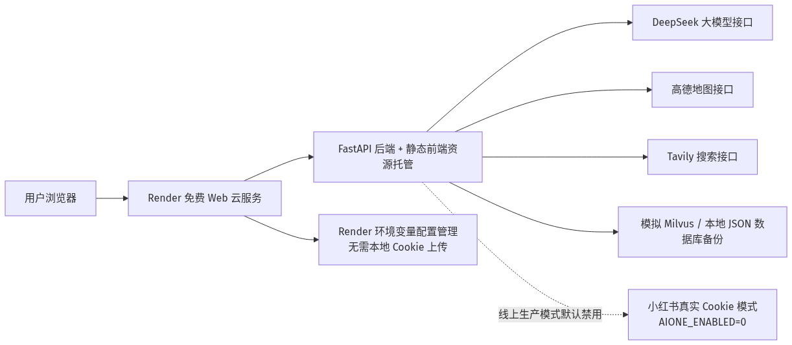


部署计划采用 Render Web Service。线上环境启用 DeepSeek、高德和 Tavily；禁用小红书 Cookie；Milvus 可先使用 JSON/mock fallback。这样可以先拿到可访问 URL，满足课程部署加分项，同时避免个人小红书账号风险。

### 6.2 未来 Obsidian 商圈知识图谱

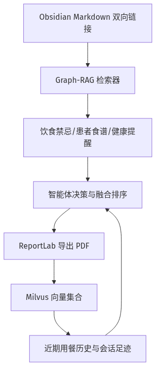


下一阶段可以把 Obsidian 换成“商圈知识卡片库”：一个商圈下面沉淀餐厅、小红书种草信息、图片、楼层、饭后娱乐、用户真实反馈。导出 PDF 后对应边权重 +1，逐渐形成用户习性画像。Milvus 不被替代，它负责相似检索和近期足迹，Obsidian/Markdown 负责人可读知识资产。

### 6.3 AI 能力演进路径

- 接入微博等公开内容源，扩展探店覆盖。
- 对无店名小红书笔记做后台低频处理，不进入实时链路。
- 为商圈、餐厅、娱乐地点建立卡片缓存，减少重复请求。
- 将 PDF 导出、地图检索和 MCP 调用纳入更完整的自动化测试。

---

## 七、课程总结（10 分）

本项目最大的收获是从“做一个能跑的功能”转向“设计一个可观测、可降级、可扩展的 Agent 系统”。真实项目中的 Agent 不只是调用大模型，还要管理状态、选择工具、处理超时、隔离密钥、记录日志、产出可复现报告。

SDD 方法在本项目中很有价值：Product Spec 明确目标，Architecture Spec 明确边界，API Spec 明确可执行接口。后续功能反复变化时，系统仍能围绕“自己做”和“出去吃”两条主链路演进，而不是堆临时逻辑。

对课程的建议是增加一次部署与验收演练，让学生更早处理环境变量、外部 API、冷启动、日志、安全防护和可访问 URL 等工程问题。这些问题往往决定一个 AI 应用是否能从本地 Demo 走向可提交项目。
