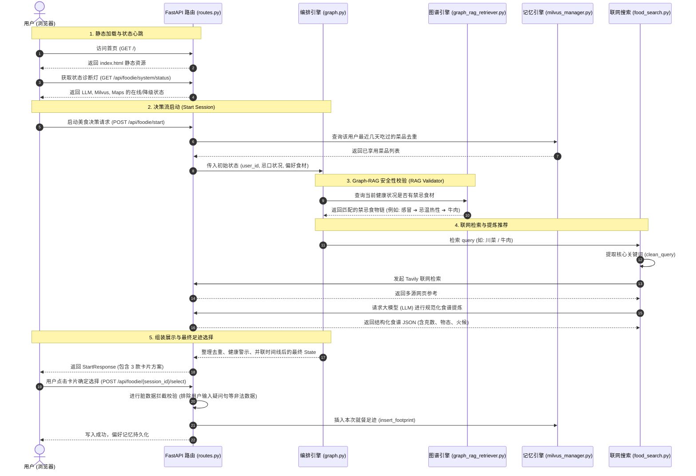

# SuperFoodie 全生命周期与初始化流程说明书

本说明文档阐述了用户从访问 SuperFoodie 网页到启动美食推荐并完成交互的完整生命周期流程、数据流动以及对应的后台代码链路。

---

## 🗺️ 全生命周期流程图

---

## 🔍 初始化关键步骤与代码定位

### 1. 静态主页及高频诊断灯加载
* **前端初始化挂载**：当用户访问项目根路径 `http://localhost:8000/` 时，由 FastAPI 直接挂载静态 index.html 文件。
  * 📍 **代码实现**：[routes.py:L335-340](file:///e:/antigravity/agent/src/api/routes.py#L335-L340)
* **系统诊断灯心跳**：前端通过定时轮询 `GET /api/foodie/system/status`，检测 LLM、Milvus 和高德 API 是否在线。
  * 📍 **代码实现**：[routes.py:L61-113](file:///e:/antigravity/agent/src/api/routes.py#L61-L113)

### 2. 智能助手流启动 (POST /api/foodie/start)
当用户点击“启动美食决策”时：
1. **生成唯一会话 ID**：后端生成 `session-xxxxxxxx`。
2. **审计日志实例化**：审计日志写入 `logs/audit.jsonl`，前端轮询 `GET /api/foodie/audit/logs` 将日志以黄绿色实时渲染到前端诊断控制台。
   * 📍 **代码实现**：[routes.py:L121-137](file:///e:/antigravity/agent/src/api/routes.py#L121-L137) | [audit_log.py:L15-33](file:///e:/antigravity/agent/src/harness/audit_log.py#L15-L33)
3. **调用状态机引擎**：调用 LangGraph 驱动的智能体拓扑 `graph_engine.run(initial_state)`。
   * 📍 **代码实现**：[routes.py:L141](file:///e:/antigravity/agent/src/api/routes.py#L141) | [graph.py:L11-20](file:///e:/antigravity/agent/src/agent/graph.py#L11-L20)

### 3. Graph-RAG 知识图谱校验与过滤
在大模型做推荐前，系统从基于 Markdown 双链的 Obsidian 知识库中拉取规则，校验用户的健康状况是否与搜索词/推荐菜冲突：
* **解析食物图谱与忌口属性**：递归搜索 `obsidian_vault/` 里的 Markdown 连通分支（如 `感冒.md` 包含 `[[忌温热性]]`，而 `牛肉.md` 包含 `[[温热性]]`，建立冲突链）。
* **触发安全预警**：检测到冲突后，在 `health_explanation` 中输出温馨提示，并直接拦截对应食材的推荐。
  * 📍 **代码实现**：[graph_rag_retriever.py:L10-45](file:///e:/antigravity/agent/src/tools/graph_rag_retriever.py#L10-L45)

### 4. 联网多渠道美食检索 (food_search.py)
* **清洗与防污染**：利用 `clean_query` 去除用户输入中的口语长句（如“我想吃牛肉” ➔ “牛肉”），保护查询纯净度。
  * 📍 **代码实现**：[food_search.py:L136-144](file:///e:/antigravity/agent/src/tools/food_search.py#L136-L144)
* **Tavily 联网搜索**：如果配置了 `TAVILY_API_KEY`，真实检索多渠道食材、克数与步骤。
  * 📍 **代码实现**：[food_search.py:L201-232](file:///e:/antigravity/agent/src/tools/food_search.py#L201-L232)
* **大模型结构化提炼**：将杂乱网页摘要提炼为包含物态控制火候、食材克数与平替的结构化食谱。
  * 📍 **代码实现**：[food_search.py:L275-306](file:///e:/antigravity/agent/src/tools/food_search.py#L275-L306)

### 5. 脏数据拦截与 Milvus 写入 (POST /api/foodie/{session_id}/select)
当用户选择某个菜谱卡片：
* **脏数据校验拦截**：校验菜品名是否包含 `怎么`、`？` 等用户误传的长句，若是则以 HTTP 400 阻断。
  * 📍 **代码实现**：[routes.py:L205-245](file:///e:/antigravity/agent/src/api/routes.py#L205-L245)
* **持久化至 Milvus/本地 Mock**：最终选定的无脏数据规范菜名正式写入 Milvus 的足迹库中。
  * 📍 **代码实现**：[routes.py:L248-265](file:///e:/antigravity/agent/src/api/routes.py#L248-L265) | [milvus_manager.py:L137-164](file:///e:/antigravity/agent/src/memory/milvus_manager.py#L137-L164)
