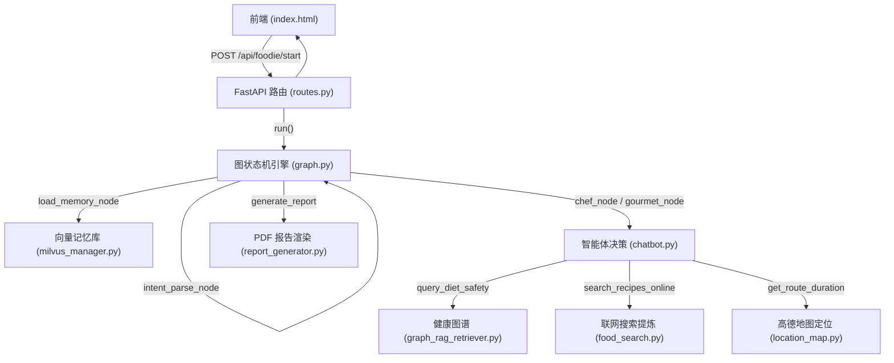

# SuperFoodie 全链路运行顺序与文件列表说明

当用户在前端发起交互时，SuperFoodie 系统的请求与数据在后台流经了清晰的代码链路。以下为您整理每一次运行的核心文件与函数执行顺序：

---

## 1. 核心运行顺序与函数调用链

---

## 2. 详细执行文件与代码行定位列表

当您点击前端**“开始推荐”**（自己做模式）时，后台依次经历以下调用顺序：

| 顺序 | 执行文件 | 核心类与函数 | 作用与逻辑定位 |
| :--- | :--- | :--- | :--- |
| **1** | [routes.py](file:///e:/antigravity/agent/src/api/routes.py) | `start_foodie_flow` (L107) | 接收前端的 JSON 请求（包含人数、健康状况、所在位置等），实例化审计日志记录器，调用状态机入口。 |
| **2** | [graph.py](file:///e:/antigravity/agent/src/agent/graph.py) | `run` (L166) | 驱动吃货状态机按顺序激活图节点：首先进入记忆加载节点，然后解析意图并分流。 |
| **3** | [milvus_manager.py](file:///e:/antigravity/agent/src/memory/milvus_manager.py) | `get_recent_footprints` (L176) | 图节点 `load_memory_node` 阶段：通过 PyMilvus 物理检索当前用户近 7 天内的就餐足迹历史，存入图状态。 |
| **4** | [chatbot.py](file:///e:/antigravity/agent/src/agent/chatbot.py) | `get_recipe_recommendation` (L70) | 图节点 `chef_node` 阶段：智能主厨开始多轮决策，前置进行忌口与足迹去重。 |
| **5** | [graph_rag_retriever.py](file:///e:/antigravity/agent/src/tools/graph_rag_retriever.py) | `query_diet_safety` (L86) | 安全校验阶段：扫描用户当前的疾病状况（如感冒/痛风）与食材的属性引用，进行 DFS 冲突计算。 |
| **6** | [food_search.py](file:///e:/antigravity/agent/src/tools/food_search.py) | `search_recipes_online` (L135) | 联网搜索与大模型提炼阶段： 1. 通过 `Tavily API` 联网检索做法。 2. 喂给大模型提取规范化食谱 JSON（含焯水、平替、卡路里等信息）。 |
| **7** | [chatbot.py](file:///e:/antigravity/agent/src/agent/chatbot.py) | 去重兜底与步骤检索 (L160-L191) | 去重被过滤时的补偿逻辑：若首选菜吃过，重新动态寻找未享用过的备选菜品并二次发起 `search_recipes_online` 联网检索，确保去重推荐步骤完整饱满。 |
| **8** | [chatbot.py](file:///e:/antigravity/agent/src/agent/chatbot.py) | 人数搭配与并联时间线 (L193-L245) | 套膳编排逻辑：如果人数 > 1，自动将其扩展为一荤一素一汤组合套膳（防菜肴重复），自动乘以折算系数，并生成 25 分钟并联烹饪时间线。 |
| **9** | [milvus_manager.py](file:///e:/antigravity/agent/src/memory/milvus_manager.py) | `insert_footprint` (L133) | 足迹归档阶段：将本次确定推荐的菜肴名及元数据插入 Milvus 中，为下一次去重提供依据。 |
| **10** | [report_generator.py](file:///e:/antigravity/agent/src/tools/report_generator.py) | `generate_report` (L45) | 决策报告编译阶段：自动注册微软雅黑/宋体字库（防 PDF 乱码），将本地食材高清插图绘制进 ReportLab，编译输出高保真 PDF 决策报告。 |

---

## 3. 外出探店模式下的附加执行顺序

当您选择**“出去吃”**模式时，在步骤 **6** 之后会发生以下分支变化：

* 调用 [food_search.py](file:///e:/antigravity/agent/src/tools/food_search.py) 中的 `search_nearby_restaurants`，根据位置、人均预算及就餐人数检索周边推荐店铺。
* 调用 [location_map.py](file:///e:/antigravity/agent/src/tools/location_map.py) 中的 `get_route_duration`（L11），将当前定位和选中的餐馆名传递给高德地图 API 进行地理编码和两点间公交/驾车出行耗时规划。
* 将安全检测路径（如痛风患者在餐馆特色菜里匹配到了毛肚）转化为醒目的红色警示语 HTML（[chatbot.py:L280](file:///e:/antigravity/agent/src/agent/chatbot.py#L280)）渲染到前端及 PDF 中，但不拦截商铺本身，提升用户体验。
